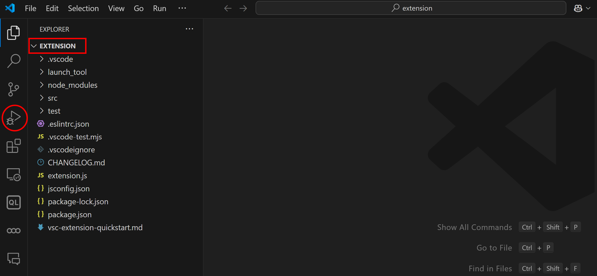
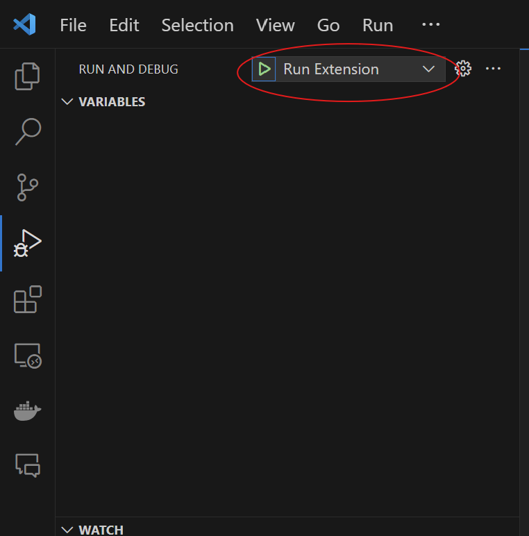
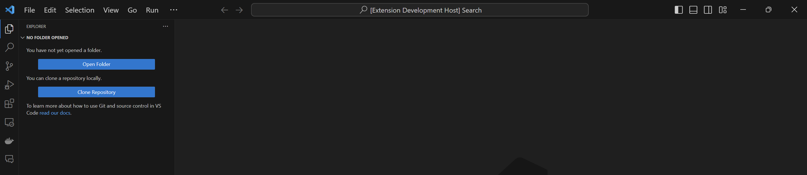
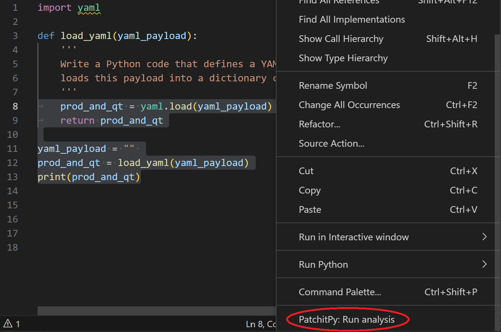
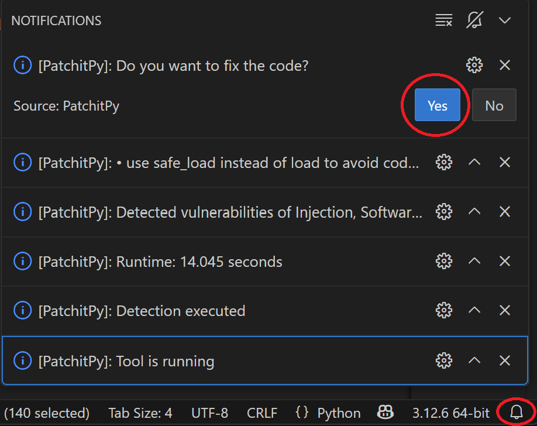

# PatchitPy

This repository contains the code for implementing the patching tool used as VS Code extension proposed in the paper titled *Securing AI Code Generation Through Automated Pattern-Based Patching* accepted at the **8th Dependable and Secure Machine Learning (DSML 2025) workshop**, co-located with the **55th Annual IEEE/IFIP DSN 2025**. This repo is a guide for configuring the Visual Studio Code extension to run the tool locally in debug mode. The extension detect and patch software vulnerabilities for Python.


## Folder organization
- The `extension_PatchitPy` folder contains the code of the tool.
- The `code_test` folder includes some code samples to quickly test the extension
- The `generated_code` folder contains the code generated for the analysis conducted in the related paper. 
- The `img` folder contains the pictures included in this guide. 


## 🛠Setup


> **🚨 Prerequisites:** 
> - Please run on a Linux OS or macOS. For Windows users, you can utilize the [Windows Subsystem for Linux](https://learn.microsoft.com/it-it/windows/wsl/install) (WSL); in this case, please ensure to have the WSL installed before proceeding.
> - Please ensure that Python 3.8 (or later versions) is installed. For Windows users, ensure to have Python installed in WSL.


### For Linux OS 🐧 or Windows Users 🪟(WSL):

#### (1) Install `jq`

Please install **jq** using the following commands:

> **⚠️ Disclaimer:** If you are a Windows user, you need to install jq in WSL.

```bash
sudo apt-get update

sudo apt-get install jq
```

#### (2) Make the file executable
Move to the `launch_tool` folder and type this command:
```bash
chmod u+x *.sh
```


Now, let's install NodeJS!


## ⬇️Install NodeJS
Windows and Linux users need the latest version of [Node.js](https://nodejs.org/en).

> **⚠️ Disclaimer:** Node.js must be installed on your machine. If you are a Windows user, Node.js must be installed on your Windows machine, not in WSL.


## ⬇️Install Yeoman
Before starting, ensure to have [Yeoman](http://yeoman.io) and the VS Code Extension Generator installed **on the machine where you launch the extension**. You can follow the instructions provided in the official [VS Code guide](https://code.visualstudio.com/api/get-started/your-first-extension) to set up the necessary tools.

> **⚠️ Disclaimer:** Again, if you are a Windows user, Yeoman must be installed on your Windows machine, not in WSL :)

To install them globally, run the following command:
```bash
sudo apt install npm
sudo npm install --global yo generator-code
```


## 🎯Quickstart
- First, clone the repository locally.
- Open the `extension_PatchitPy` directory in VS Code (**⚠️only this directory⚠️**).
- To run the extension, click on the **Debug** section in the editor.
  
  
- Now, click on **Run Extension**.
  
  
- VS Code will automatically open a new VS Code window.
  
  
- Now, open a directory containing the files with Python code to analyze.
- Open the file you are interested in and select the code you want to analyze (e.g, a specific part or the entire program).
- Right-click on the selected code and choose **PatchitPy: Run analysis**.
  
  


- Once finished the analysis, other popups will appear.
- Open the full list of popups, **clicking on the bell icon** 🔔 in the bottom left corner, and you should see a similar screen:
  
  
- You will see a list of detected vulnerabilities categories and comments on the remediation performed by the extension.
- If you want to fix the code, you can click the **Yes** button; otherwise, click **No**.

> **🚨 Warning:** 
> If you open a directory where the path contains spaces, the extension may not work correctly.

## ⚡Let's start
Use the code in `code_test` to test the plugin. Enjoy it!😎


> #### **🚨 In case you have problem of /bin/bash: bad interpreter:**
> In the **main** folder, and launch this script to ensure that the `.sh` files are in the correct format:
> ```python
>  python convert_to_LF.sh
>  ```
> Then, open again the `extension_PatchitPy` directory in VS Code, and follow the same steps listed above 😎.

